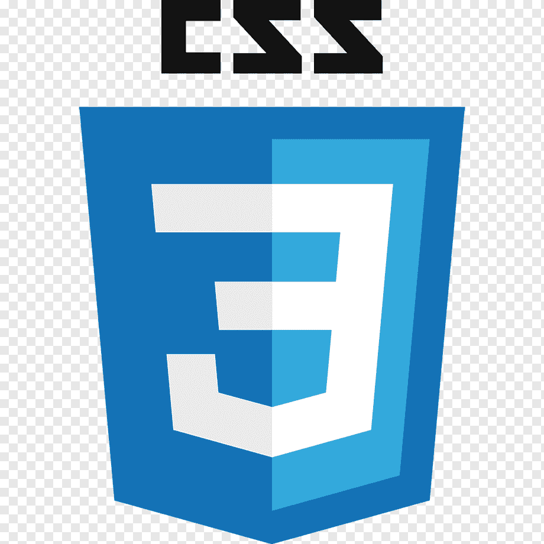

# Aleksandr Izmailow

<div>
    
</div>

## Contacts:

- Location: Minsk, Belarus
- Phone: +375 29 217 12 40
- E-mail: iz_84@mail.ru
- Telegram: @aleks_bass
- Codewars: @izmailowAlex
- GitHub: @izmailowAlex
- Discord: Alex_zip(@izmailowAlex)

<div>
  <a href="https://www.linkedin.com/in/aleksandr-izmailow/">
    
  </a>
  <a href="https://www.codewars.com/users/rsschool_fedffb7cb5e5775b">
    
  </a>
  <a href="https://github.com/izmailowAlex">
    
  </a>
</div>

## About me:

## _I have been studying JavaScript since 2020. I decided to try myself in a new field, because I like to keep up with the times, learn something new, and I really like spending time at the computer._

## Hard Skills:

- JAVASCRIPT
- TYPESCRIPT
- HTML
- CSS/SASS/SCSS
- REACTJS
- MOBX
- WEBPACK
- GIT/GITHUB
- PHOTOSHOP
- FIGMA

<div>
  &nbsp;
  &nbsp;
  &nbsp;
  &nbsp;
  &nbsp;
  &nbsp;
  &nbsp;
  &nbsp;
  &nbsp;
</div>

## Code example

```
function stairsIn20(a) {
  return 20 * a.reduce((s, a) => s + a.reduce((s, n) => s + n, 0), 0);
}
```

## Education:

- University - Belorussian Academy of Music
- Courses -
  - [MyITSchool - Front-end веб-разработке: HTML, CSS, JavaScript, ReactJS, MobX ...](https://myitschool.by/)
  - [RSSchool - JavaScript/Front-end](https://rs.school/)

---

## English:

**B1** (studying at the school of foreign languages Streamline)

## My works

- [Schelter](https://izmailowalex.github.io/Shelter/shelter/pages/main/)
- [Online-store](https://online-store-balloon.netlify.app)
- [Music-quiz](https://github.com/izmailowAlex/music_quiz)
- [Carousel](https://github.com/izmailowAlex/Carousel)
- [Hardware-store](https://radiant-valkyrie-5a3c60.netlify.app/)
